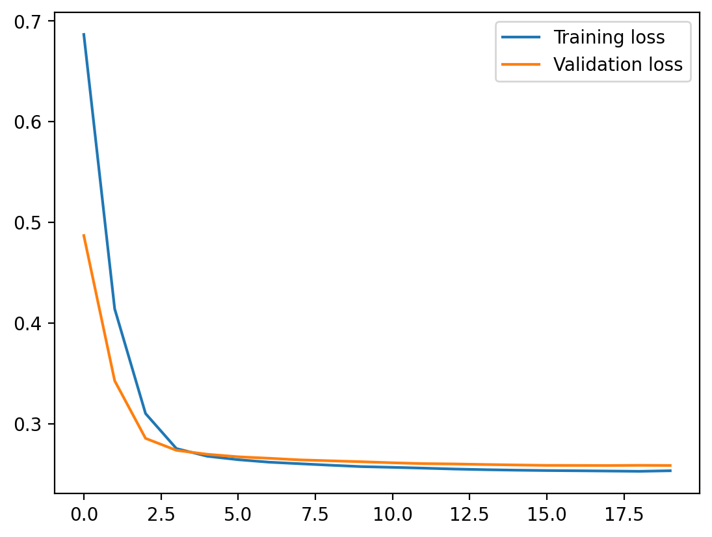
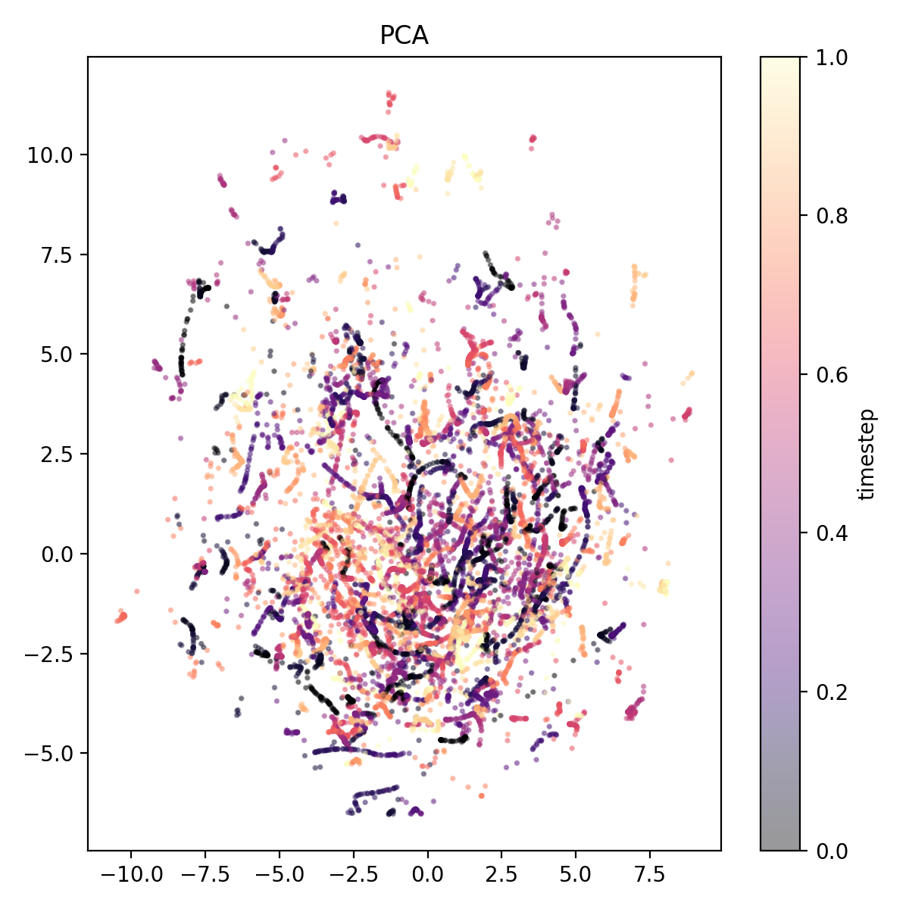
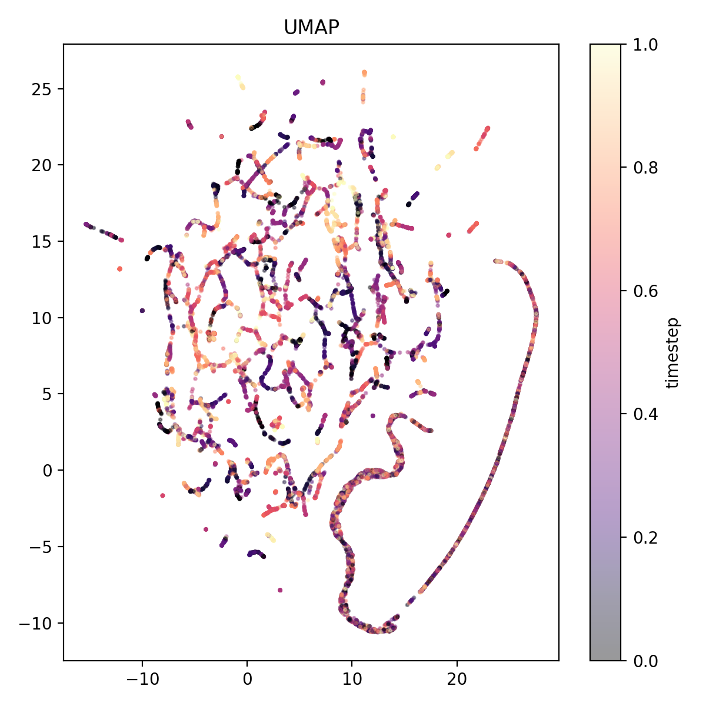

# JEPA-MD: Latent-Space Molecular Dynamics with EGNNs

This project explores a JEPA-style architecture for learning molecular dynamics directly in latent space. Equivariant graph neural networks (EGNNs) are used to encode molecular states into a symmetry-respecting latent representation, while a separate predictor EGNN learns the temporal evolution of these latent states.

The model is trained using a student–teacher setup with an exponential moving average (EMA) target network, encouraging the latent space to capture predictive structure without direct supervision in state space. The overall architecture is shown below.

Once a coherent latent space is learned, physical observables such as energies can be inferred from latent representations, and trajectories can be evolved purely in latent space using the learned predictor.

## Results

### Training Dynamics

The model is trained using a JEPA-style student–teacher objective with an EMA target network. The training and validation losses decrease rapidly during the early epochs and then plateau smoothly, indicating stable optimization without signs of divergence or severe overfitting.

Notably, the validation loss closely tracks the training loss throughout training, suggesting that the learned latent representations generalize across independently generated trajectories rather than memorizing specific dynamics.

---

### Latent Structure: PCA

To probe the structure of the learned latent space, node-level latent embeddings are projected into two dimensions using Principal Component Analysis (PCA) and colored by timestep.

Despite PCA being a strictly linear projection, the latent embeddings exhibit nontrivial geometric structure with smooth temporal progression. This indicates that dominant variance directions in the latent space align with meaningful dynamical modes, rather than collapsing into an unstructured cloud.

---

### Latent Structure: UMAP

A nonlinear projection using UMAP further reveals the organization of the latent space.

The UMAP embedding shows clear low-dimensional manifolds with smooth color gradients. These features suggest that the model has learned a coherent latent phase space in which temporal evolution corresponds to continuous motion along structured trajectories.

Importantly, this structure emerges without explicit supervision on physical quantities such as energy or position, indicating that the predictive self-supervised objective is sufficient to induce meaningful dynamical organization in the latent space.

---

### Summary

Together, the training curves and latent visualizations demonstrate that the model learns:

* a stable predictive objective,
* a structured latent representation of molecular dynamics,
* and low-dimensional dynamical organization that persists across linear (PCA) and nonlinear (UMAP) probes.

These results support the feasibility of evolving molecular systems directly in latent space and motivate further exploration of latent rollouts and observable prediction.

